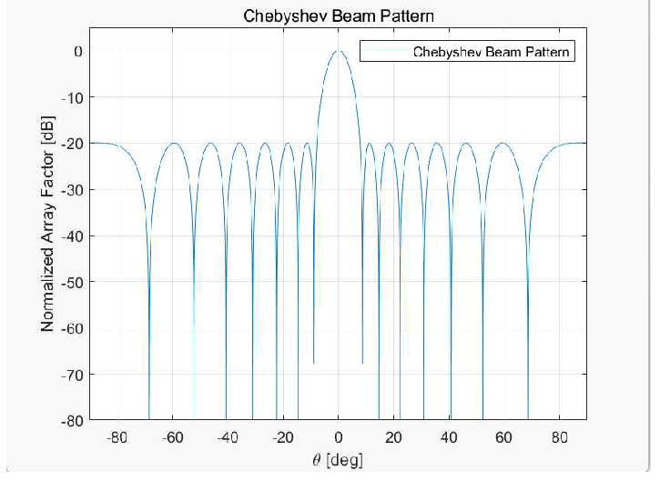
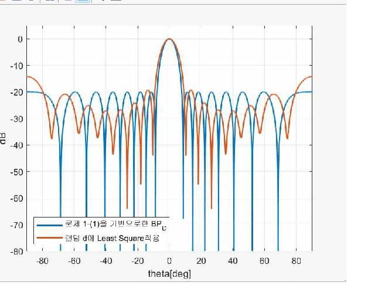
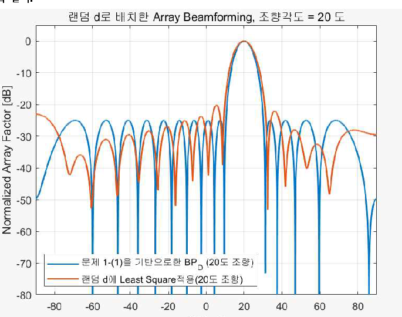

# Smart Antenna Beamforming Analysis

> MATLAB 기반 ULA 빔패턴 형성, 빔 조향 및 비등간격 배열의 Least Squares 가중치 보상 분석


## Overview

스마트안테나 교과 과제에서 15소자 ULA(Uniform Linear Array)를 대상으로 배열 가중치와 소자 배치가 빔패턴에 미치는 영향을 MATLAB으로 분석했습니다. 기준 배열의 Chebyshev 빔패턴을 생성한 뒤, 빔 조향과 비등간격 배열 조건에서도 목표 패턴에 가깝게 만드는 가중치 계산 과정을 비교했습니다.

## Objectives

1. Chebyshev 가중치로 정규화된 빔패턴과 부엽 수준을 확인합니다.
2. -60°부터 +60°까지 10° 간격으로 빔을 조향해 방향별 패턴 변화를 비교합니다.
3. 0.2λ에서 0.7λ 범위의 비등간격 배열에서 기준 빔패턴을 목표값으로 설정합니다.
4. Least Squares 방식으로 가중치를 계산하고 기준 배열과 비등간격 배열의 결과를 비교합니다.

## System Configuration

| Item | Configuration |
| --- | --- |
| Array type | 15-element ULA |
| Reference spacing | λ/2 |
| Weighting method | Chebyshev weighting |
| Beam steering | -60° to +60°, 10° interval |
| Non-uniform spacing | 0.2λ to 0.7λ, randomly generated |
| Compensation method | Least Squares weight calculation |

## Analysis Flow

```text
Reference ULA and Chebyshev weights
        ↓
Normalized Array Factor and beam steering
        ↓
Random non-uniform element spacing
        ↓
Steering matrix construction
        ↓
Least Squares weight calculation
        ↓
Reference and compensated beam pattern comparison
```

## Results

### 1. Chebyshev Beam Pattern

15소자, 반파장 간격 배열에서 Chebyshev 가중치를 적용해 기준 빔패턴을 생성했습니다. 주엽을 0 dB로 정규화하고 부엽 수준을 확인했습니다.



### 2. Least Squares Compensation for Non-uniform Array

랜덤한 소자 간격으로 구성한 배열에 대해 steering matrix를 만들고, 기준 Chebyshev 패턴과의 오차 제곱합이 작아지도록 Least Squares 가중치를 계산했습니다. 주엽의 위치와 형상은 기준 패턴에 가깝게 유지되지만, 비등간격 배치 특성으로 부엽 영역에는 차이가 남는 것을 확인했습니다.



### 3. Beam Steering at 20°

학생번호 끝자리 조건에 따라 20° 조향을 적용하고, 비등간격 배열에서도 동일 방향의 빔패턴을 목표로 Least Squares 가중치를 계산했습니다.



## Repository Structure

```text
.
├── beam_subject0.m                 # Chebyshev pattern and single-angle steering
├── beam_subject1.m                 # Beam steering from -60° to +60°
├── beam_subject2.m                 # Monopulse ratio and slope analysis
├── UniformBeamforming.m            # Uniform weighting baseline
├── pdf_SM_1.m                      # Uniform beam pattern implementation
├── pdf_SM_2.m                      # Chebyshev weight calculation
├── pdf_SM_3.m                      # Chebyshev beam pattern implementation
└── assets/                         # Result figures extracted from the submitted report
```

## How to Run

1. MATLAB에서 각 `.m` 파일을 엽니다.
2. `beam_subject0.m`은 소자 수, 부엽 수준, 조향각을 입력해 단일 조향 결과를 확인합니다.
3. `beam_subject1.m`은 다중 조향각의 빔패턴을 출력합니다.
4. `beam_subject2.m`은 인접 빔 간 Monopulse Ratio와 기울기를 출력합니다.

## Notes

- 본 저장소는 스마트안테나 교과 과제에서 수행한 시뮬레이션 분석 코드입니다.
- 비등간격 배열의 소자 간격은 난수로 생성되므로 실행마다 세부 빔패턴은 달라질 수 있습니다.
- 결과 이미지는 과제 제출본의 시뮬레이션 결과를 바탕으로 정리했습니다.

## Skills Used

`MATLAB` `Array Factor` `Chebyshev Beamforming` `Beam Steering` `Least Squares` `Monopulse Analysis`
